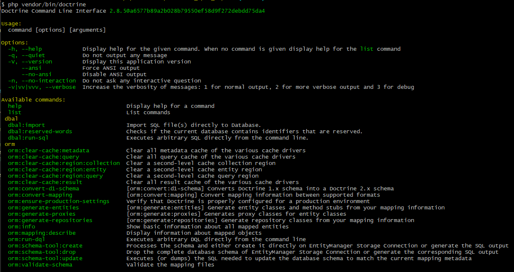

# Sciences-U - B3 IW - PHP7 MVC from scratch

- [Introduction](#introduction)
- [Démarrage](#démarrage-du-projet-avec-composer)
  - [Mise à jour de Composer](#mise-à-jour-de-composer)
  - [Initialisation du projet](#initialisation-du-projet)
  - [Autoloading PSR-4](#déclaration-de-lautoloading-psr-4)
  - [Point d'entrée de l'application](#définition-dun-point-dentrée-pour-notre-application)
- [Lancement du projet en ligne de commande](#premier-lancement-du-projet-en-ligne-de-commande)
- [Un point sur MVC](#point-théorique-rapide-sur-le-modèle-mvc)
  - [Modèle](#modèle)
  - [Vue](#vue)
  - [Contrôleur](#contrôleur)
- [Le modèle](#le-modèle)
  - [Création de la base de données](#création-de-la-base-de-données)
  - [Installation de Doctrine](#installation-de-doctrine)
  - [Configuration de Doctrine](#configuration-de-doctrine)
  - [Création d'une entité](#création-dune-première-entité)
  - [Insertion d'un enregistrement](#insertion-dun-enregistrement-en-base-de-données)
  - [Le problème des assets](#le-problème-des-assets-fichiers-statiques)

## Introduction

Ce module vise à créer une application PHP adoptant une architecture MVC.

Il existe aujourd'hui des solutions telles que Symfony ou Laravel, pour ne citer que les plus populaires, adoptant déjà ce modèle.

Ainsi, dans ce module, nous allons nous attarder sur les outils et mécanismes de PHP permettant, à partir d'un projet vide, de construire cette architecture. Le fait de ne pas s'appuyer sur la structure initiale d'un framework devrait permettre de comprendre et démystifier bon nombre de procédés utilisés par ces frameworks.

Enfin, il existe probablement des milliers de façons d'implémenter un MVC. Nous viserons ici une approche "full objet", en tentant, dans le temps qui nous est imparti, d'introduire et garder en tête des notions d'architecture logicielle pour justifier les différents choix effectués.

## Démarrage du projet avec Composer

On va créer un dossier vierge et l'ouvrir avec VSCode. Dans un terminal positionné à la racine, on initialise un dépôt Git local avec `git init`.

Composer est l'outil qui va nous permettre, dans notre projet, de gérer l'auto-chargement des classes (autoloading) ainsi que les dépendances de notre projet : les librairies externes que nous installerons et utiliserons.

### Mise à jour de Composer

`composer self-update`

### Initialisation du projet

```bash
composer init
```

#### Informations du projet

Renseigner un nom et une description. Pour le nom, tout en minuscules, sans espaces ni accents, avec uniquement des tirets (`-`) pour séparer les mots.

Le nom de votre projet doit être séparé en 2 parties : `vendor/package`.

La partie `vendor` correspond, en quelque sorte, à la personne ou bien la compagnie qui a réalisé le projet/package.

La partie package donne un nom concret à votre package/projet.

Dans mon cas, `ld-web/mvc`, par exemple.

> Ce type de fonctionnement peut se retrouver dans d'autres gestionnaires de packages, comme `npm` pour NodeJS par exemple. On peut trouver par exemple le package `@angular/cli`. Ici, le "vendor" est précédé d'un `@`

Composer va automatiquement créer un fichier `.gitignore` dans lequel il ajoutera le dossier `vendor`. En effet, ce dossier est créé automatiquement par Composer et contient les fichiers d'auto-chargement de classes ainsi que les dépendances. Nous n'avons donc pas besoin de le pousser vers le dépôt distant. N'importe quel développeur souhaitant récupérer ce projet peut clôner ce dépôt et effectuer un `composer install`, le dossier `vendor` sera recréé automatiquement.

> Quand Composer va vous demander si vous voulez ajouter des dépendances de manière interactive, répondez non. De même pour les dépendances de développement. Pour le moment nous n'avons aucune dépendance à ajouter, et ensuite, leur système interactif est un peu bizarre...

Finalement, Composer va créer un fichier `composer.json` décrivant les propriétés de notre projet.

### Déclaration de l'autoloading PSR-4

Afin d'organiser la structure de notre projet, nous allons déclarer, dans notre fichier `composer.json`, la méthode d'auto-chargement de nos classes que nous souhaitons qu'il applique.

> L'auto-chargement (ou `autoloading`), en PHP, intervient quand on souhaite utiliser une classe. PHP va chercher de quel(s) moyen(s) il dispose pour trouver le fichier de définition de cette classe. PSR-4 est une recommandation définissant une manière particulière d'aller chercher une classe. Plus d'infos et des exemples [ici](https://www.php-fig.org/psr/psr-4/)

Ainsi, nous allons renseigner la propriété `autoloading` de notre objet de configuration :

```javascript
{
  //...
  "autoload": {
    "psr-4": {
      "App\\": "src/"
    }
  }
  // ...
}
```

Nous indiquons ici à Composer que le préfixe d'espace de nom `App` correspond au dossier `src`, à la racine de notre projet. Nous allons donc créer ce dossier, et c'est dans celui-ci que se trouveront les différentes classes de notre application.

Enfin, ces classes seront organisées selon la recommandation PSR-4.

Par exemple , si je veux charger la classe ayant le FQCN `App\Controller\IndexController` :

- `App\` correspond au dossier `src/`
- On prend toutes les parties du FQCN (Fully Qualified Class Name) **sauf la dernière qui correspond au nom de la classe**, pour construire le chemin où aller chercher le fichier de la classe `IndexController`
- On en déduit donc que le fichier `IndexController.php` se trouvera dans `src/Controller/`
- Nous avons localisé le fichier de définition de la classe grâce à PSR-4

> La méthode d'autoloading PSR-4 est très largement utilisée dans l'écosystème PHP. Par exemple, dans [Symfony](https://github.com/symfony/symfony/blob/5.4/composer.json#L164) ou encore [Laravel](https://github.com/laravel/laravel/blob/8.x/composer.json#L23)

Pour finir, nous allons générer une première version du dossier `vendor` en demandant à Composer de générer les fichiers d'autoloading :

```bash
composer dump-autoload
```

### Définition d'un point d'entrée pour notre application

Traditionnellement, sur un site PHP, on va créer un fichier de script par page (par exemple `index.php`, `product.php`, ...).

Cette structure peut vite devenir redondante, surtout à mesure que le projet prend du volume.

L'idée que nous allons implémenter dans notre projet est de **bootstraper** notre application : définir un point d'entrée unique, qui réceptionnera les requêtes.

Ensuite, que ce soit via le serveur interne de PHP en ligne de commande, ou bien via un serveur web comme Apache ou NGINX, on va désigner ce fichier comme point d'entrée en routant toutes les requêtes vers lui.

Nous allons définir ce fichier dans le dossier `public` et l'appeler tout simplement `index.php`.

> Cette méthode est également adoptée dans les projets Symfony, mais aussi dans la [structure de Laravel](https://github.com/laravel/laravel/blob/8.x/public/index.php)

A présent, ce fichier nous permettra de centraliser l'initialisation des différentes parties de notre application, puis de router la requête selon les besoins.

Nous intégrons en priorité l'inclusion de l'autoloader Composer :

> Fichier : `public/index.php`

```php
<?php
require_once __DIR__ . '/../vendor/autoload.php';
```

Vous retrouverez cette modification dans [ce commit](https://github.com/ld-web/sciences_u_b3_php_mvc/commit/5a5aeee12f88160d66070d277f809e95f4d1ec5f)

Ce fichier est le **point d'entrée** de l'autoloading PSR-4 généré par Composer. Il est **indispensable** si vous souhaitez que vos classes ainsi que celles de vos dépendances soient chargées correctement.

> On retrouve également cette inclusion dans [Laravel](https://github.com/laravel/laravel/blob/8.x/public/index.php#L34)

## Premier lancement du projet en ligne de commande

Nous avons maintenant un squelette applicatif qui utilise Composer pour démarrer notre projet MVC.

Nous pouvons définir une commande pour le lancer :

```bash
# -t pour définir le répertoire racine de l'application
# Le nom du fichier en dernier pour définir le point d'entrée unique
php -S localhost:8000 -t public/ public/index.php
```

Si on exécute cette commande puis qu'on se rend sur `localhost:8000`, on a normalement une page blanche : c'est normal, dans `public/index.php`, on ne fait qu'inclure l'autoloader Composer, et rien d'autre.

L'essentiel est de s'assurer qu'on n'a pas d'erreur.

Enfin, pour éviter d'avoir à utiliser cette commande à chaque fois, on peut définir un **script Composer** qui l'exécutera pour nous :

> Fichier : `composer.json`

```javascript
{
  //...
  "scripts": {
    "start": "php -S localhost:8000 -t public/ public/index.php"
  }
  //...
}
```

On pourra ensuite facilement lancer le serveur depuis un terminal avec `composer start`.

**Note** : Il faut également ajouter la désactivation du timeout Composer dans le fichier, sinon par défaut la commande va s'interrompre au bout de 5 minutes :

```javascript
{
  //...
  "config": {
    "process-timeout": 0
  }
  //...
}
```

## Point théorique rapide sur le modèle MVC

L'architecture MVC (Modèle - Vue - Contrôleur) constitue une évolution des architectures classiques, dans la mesure où elle apporte une **séparation de responsabilités**, pour les répartir dans différentes **couches** :

### Modèle

Le modèle va être la couche de données. C'est au niveau du modèle que nous **définirons** des classes PHP, que nous appellerons des **entités**. Ces entités seront automatiquement transformées en **tables** dans la base de données. Nous pourrons ensuite utiliser et manipuler des instances de ces classes pour effectuer des opérations dans la base de données.

### Vue

La vue va être chargée **d'afficher les données**. Cette couche regroupera l'ensemble des templates nécessaires à un affichage cohérent de l'application.

### Contrôleur

Les différents **contrôleurs** que nous créerons dans notre application auront pour simple but de **coordonner** le modèle et la vue. C'est à ce niveau que se trouveront les principales briques **logiques** de l'application. Le rôle du contrôleur est d'agir en tant que **glue** entre le modèle et la vue.

## Le modèle

Afin d'éviter d'avoir à écrire une énorme quantité de classes gérant la génération de requêtes SQL via des méthodes diverses pour communiquer avec une base de données, nous pouvons ajouter et utiliser la première **dépendance** de notre projet : l'[ORM Doctrine](https://www.doctrine-project.org/index.html).

> Un ORM (Object Relational Mapper) permet simplement, depuis notre application, de communiquer avec une base de données en utilisant une syntaxe objet

### Création de la base de données

Rendez-vous dans PhpMyAdmin et créez une nouvelle base de données, `php_mvc`.

Dans cette application, nous ne disposons malheureusement pas des commandes fournies par des frameworks comme Symfony ou Laravel, nous permettant de créer automatiquement la base de données. Nous la créons donc manuellement, au préalable.

### Installation de Doctrine

Une page est disponible sur leur documentation pour son [installation et sa configuration](https://www.doctrine-project.org/projects/doctrine-orm/en/2.8/reference/configuration.html) sans framework.

Le package qui nous intéresse est `doctrine/orm` (on retrouve ici la partie `vendor/package`).

Avec Composer, en ligne de commande, on peut ajouter cette dépendance : `composer require doctrine/orm`.

Automatiquement, Composer ajoute notre dépendance dans le fichier `composer.json` ([commit concerné](https://github.com/ld-web/sciences_u_b3_php_mvc/commit/9161890874b13ae06f89aa59adb5e64d848bd4bb)).

Egalement, il a créé automatiquement un fichier `composer.lock` contenant **les versions précises des packages installés**. En effet, Doctrine ORM déclare lui-même des dépendances. Composer parcourt et installe donc en cascade les différentes dépendances.

Dans notre fichier `composer.json` on ne voit donc que Doctrine, mais dans le fichier `composer.lock` apparaissent tous les packages installés.

> Le fichier `composer.lock` est versionné. Cela permet à quelqu'un souhaitant récupérer ce projet d'installer précisément les mêmes versions que celles que nous avons, avec un simple `composer install`

Concernant le format des versions lui-même, il faut savoir que Composer utilise le versioning sémantique ([SemVer](https://semver.org/lang/fr/)).

Outils utiles :

- [SemVer Cheatsheet](https://devhints.io/semver)
- [Online SemVer Checker](https://jubianchi.github.io/semver-check/#/)

### Configuration de Doctrine

Nous utiliserons le point d'entrée de notre application pour charger et configurer Doctrine.

Doctrine fonctionne avec des **entités**, classes PHP transformées en tables de notre base de données.

Nous allons donc lui fournir le chemin vers le dossier dans lequel se trouveront nos entités : `src/Entity` (nos classes d'entités auront donc le namespace `App\Entity`).

Nous activons ensuite le mode développement, puis définissons les coordonnées de la base de données.

> Dans une prochaine étape, nous déporterons les identifiants de connexion à la base dans des fichiers séparés, non versionnés

Finalement, nous récupérons un objet de configuration, puis créons un gestionnaire d'entités (`EntityManager`) à l'aide des coordonnées de connexion et de l'objet de configuration.

> C'est cet `EntityManager` qui nous permettra d'échanger avec notre base de données

Enfin, selon les préconisations de la documentation, pour pouvoir utiliser des commandes de la console et créer notre schéma, le mettre à jour, etc..., nous créons un fichier `cli-config.php` à la racine du projet.

Retrouvez le commit correspondant [ici](https://github.com/ld-web/sciences_u_b3_php_mvc/commit/30357810412bdc8e4cecc7a584a3c995b55c3040).

Une fois Doctrine configuré, depuis notre terminal, nous pouvons exécuter la commande suivante pour consulter les commandes Doctrine disponibles : `php vendor/bin/doctrine`.



### Création d'une première entité

Nous allons créer une entité `User`. Cette entité sera donc une classe PHP utilisant les **annotations Doctrine**, pour permettre à Doctrine d'analyser le format de l'entité, et pouvoir impacter la base de données automatiquement en conséquence.

Dans le dossier `src/Entity`, créer un fichier `User.php` ([commit concerné](https://github.com/ld-web/sciences_u_b3_php_mvc/commit/fbf9bb7213f8c313aa926ee0e82cbb4c2da413d5)).

Les différentes annotations utilisées (`Entity`, `Table`, `Column`, ...) définissent donc les différentes propriétés de l'entité ([référence de toutes les annotations](https://www.doctrine-project.org/projects/doctrine-orm/en/2.8/reference/annotations-reference.html#index)).

Pour valider le schéma créé, exécuter :

```bash
php vendor/bin/doctrine orm:validate-schema
```

Normalement, Doctrine va pouvoir indiquer que le format d'entité est correct, mais que la base de données n'est pas synchronisée avec notre codebase !

Nous allons donc créer le schéma de la base de données automatiquement, avec la commande suivante :

```bash
php vendor/bin/doctrine orm:schema-tool:create
```

Si on retourne dans PhpMyAdmin, on remarque que la table a été créée.

### Insertion d'un enregistrement en base de données

Nous avons à présent configuré Doctrine et créé notre base de données et notre schéma.

Nous allons tenter de créer un enregistrement `User` dans la table associée, depuis notre application.

Pour ce faire, nous allons implémenter 3 étapes :

- Création d'une instance d'objet `User` et affectation de ses champs
- Persistence de l'objet auprès du gestionnaire d'entités
- Déclenchement de l'insertion de l'objet ou des objets persistés avec `flush` sur le gestionnaire d'entités

```php
$user = new User();
$user->setName("Bob");

// Persist permet uniquement de dire au gestionnaire d'entités de gérer l'entité passée en paramètre
// Persist ne déclenche pas automatiquement une insertion
$entityManager->persist($user);
// Pour déclencher l'insertion, on doit appeler la méthode "flush" sur le gestionnaire d'entités
$entityManager->flush();
```

### Le problème des assets (fichiers statiques)

Lorsqu'on consulte `localhost:8000`, le navigateur envoie en réalité 2 requêtes :

- Une pour notre page, vers `/`
- Une autre pour récupérer le favicon `/favicon.ico`

Etant donné que nous avons configuré notre serveur pour qu'il redirige tout vers `public/index.php`, alors notre requête est exécutée 2 fois, et il en résulte que deux enregistrements sont persistés en base de données.

Nous devons donc filtrer les requêtes entrantes, pour pouvoir servir les éléments statiques directement, sans mettre en oeuvre la logique de notre application.

Pour commencer, nous pouvons indiquer dans notre point d'entrée la chose suivante : si on vient bien d'une page web, et que l'URI demandée termine par une extension de fichier image, alors on retourne `false`. Cela permet d'envoyer directement la ressource demandée, ou bien une 404 si elle n'est pas trouvée.

Voir le [commit concerné](https://github.com/ld-web/sciences_u_b3_php_mvc/commit/b010a4d71b77e443164de19209ac88a975068e69).

## Configuration

Nous avons un autre problème à régler : la configuration pour accéder à la base de données se trouve dans le fichier `public/index.php`, et est versionnée. Elle apparaît donc dans ce dépôt Github, en clair.

Ensuite, si quelqu'un d'autre clône ce dépôt, alors soit on sera obligé de s'adapter aux paramètres déclarés dans le fichier, soit on devra changer les paramètres. Mais si on les change, alors du point de vue de Git, il y aura un changement de fichier à commiter.

Nous avons donc besoin d'externaliser la configuration de notre application, et de pouvoir ensuite y faire référence depuis notre application.

### Les fichier .env

Les fichiers .env permettent de stocker des paires de clés/valeurs.

Ensuite, on peut utiliser un package comme `symfony/dotenv` pour lire le contenu du fichier et le mapper automatiquement dans le tableau superglobal `$_ENV` de PHP.

On installe donc le composant DotEnv de Symfony : `composer require symfony/dotenv`.

Ensuite, on peut donc déclarer des valeurs par défaut pour nos variables, dans un fichier `.env`.

Les valeurs effectivement utilisées en local, sur notre machine, peuvent quant à elle être déclarée dans un fichier `.env.local`, non versionné sur Git.

> Le fichier `.env` contient donc des valeurs par défaut et sera versionné. Le fichier `.env.local`, non versionné, viendra, pour chaque environnement différent, écraser les valeurs par défaut, pour avoir la configuration adaptée à chaque machine (ou environnement). Du point de vue de l'application, on se contente donc de faire référence à la configuration, sans utiliser de valeurs explicites

Commit concerné : [https://github.com/ld-web/sciences_u_b3_php_mvc/commit/58f238caea0a3640eff6bb46552d3a1f4d3e0ba3](https://github.com/ld-web/sciences_u_b3_php_mvc/commit/58f238caea0a3640eff6bb46552d3a1f4d3e0ba3)

Par ailleurs, le composer DotEnv de Symfony introduit également une variable `APP_ENV`, positionnée par défaut à la valeur `dev`. Cette variable peut permettre de configurer les packages selon l'environnement dans lequel on se trouve.

## Les contrôleurs et le routage des requêtes

Pour le moment, notre page d'accueil crée un utilisateur et l'enregistre en BDD. Tout ça se déroule dans le fichier `public/index.php`.

Mais nous préférerions pouvoir définir plusieurs endroits correspondant aux différentes "pages" de notre application.

Par ailleurs, on aimerait pouvoir les définir en étant adapté à un format d'URL comme `/user/profile`, ou encore `/admin/product/edit/5`.

Pour réceptionner les requêtes et les traiter, on va créer une couche de **contrôleurs**.

Ensuite, pour pouvoir trouver le bon contrôleur à exécuter lors de la réception d'une requête, nous aurons besoin d'un **routeur**.

### Contrôleurs

Comme indiqué précédemment, un contrôleur n'agit qu'en tant que **glue** entre le modèle et la vue.

On peut donc déplacer le bout de code qui crée un utilisateur dans une classe `App\Controller\HomeController` ([lien](https://github.com/ld-web/sciences_u_b3_php_mvc/commit/2c4106ff130609324bc6712c7b11b3d97199817e#diff-cf8ddd8abc8d002c914ecaae76ad52cf5fea1a58eae9d998ba252d0b804b80e6))

### Routeur

Dans l'index, il est donc maintenant question d'enregistrer des routes, puis de dispatcher une requête entrante auprès du routeur, afin qu'il puisse router cette requête vers le bon contrôleur, en fonction de ses routes enregistrées.

La classe `Router` est donc définie dans un premier temps avec les méthodes suivantes :

- `addPath` pour ajouter une route
- `execute` pour router une requête vers la bonne route
- `checkPath` pour vérifier qu'une route correspondant à une URL et une méthode HTTP existe ou non

Dans le fichier `public/index.php`, on peut donc ajouter notre route pour la page d'accueil :

```php
$router->addPath(
  '/',
  'GET',
  'home',
  HomeController::class,
  'index'
);
```

### Les dépendances des contrôleurs

Avec ce premier mécanisme, on peut router une requête vers un contrôleur.

Mais un autre problème émerge : le contrôleur de notre page d'accueil crée un utilisateur et l'enregistre en base de données. Il consomme donc une instance de l'entity manager.

Quand nous avons enregistré la référence à la méthode `index` dans notre routeur, nous avons simplement désigné la méthode avec une chaîne de caractères, sans ajouter les paramètres qu'elle attendait.

Nous devons donc trouver un moyen d'**injecter** automatiquement la dépendance, donc le gestionnaire d'entités, dans notre `HomeController`, et ce au moment où nous exécutons la méthode `index`.

#### La Réflexion

Avec PHP, nous pouvons analyser par programmation la signature d'une méthode, le contenu d'une classe, etc...par programmation.

L'idée ici va donc être d'utiliser la réflexion, afin d'identifier les paramètres présents dans un contrôleur, et pouvoir injecter les paramètres attendus lors de son exécution.

Quelque soit la méthode enregistrée pour une route, on sera donc capables de trouver les arguments qui doivent être passés.

Nous adaptons donc la méthode `execute` de la classe `Router` afin d'analyser et injecter les paramètres adéquats ([lien](https://github.com/ld-web/sciences_u_b3_php_mvc/commit/2c4106ff130609324bc6712c7b11b3d97199817e#diff-95fd90c4e82eb78455558373d51bfb443010152c93eb52b9ff9730cff2a80c96R29)).

> Nous utilisons la classe `ReflectionMethod` pour récupérer les paramètres d'une méthode et leur type

Enfin, lorsque nous trouvons un paramètre, comme `EntityManager` pour notre méthode `index`, il s'agit de récupérer une instance déjà créée du gestionnaire d'entités. Nous ajoutons à la classe `Router` un attribut `params`, tableau associatif qui contiendra en tant que clé le type de paramètre, et en tant que valeur l'instance correspondante à injecter.

> Note : pour appliquer le principe d'**inversion de dépendance** nous aurions également pu désigner l'interface `EntityManagerInterface` au lieu du type concret `EntityManager`. Passer par une abstraction permet de rendre plus flexible le type concret de la valeur que l'on injecte concrètement au moment de l'exécution

Retrouvez la première version du routeur [ici](https://github.com/ld-web/sciences_u_b3_php_mvc/commit/2c4106ff130609324bc6712c7b11b3d97199817e#diff-95fd90c4e82eb78455558373d51bfb443010152c93eb52b9ff9730cff2a80c96).

> Note : de nombreuses améliorations sont possibles dans ce routeur. Cette partie ne constitue qu'une brève introduction à l'injection de dépendances. Dans un premier temps, on pourrait refactoriser beaucoup de choses pour avoir une meilleure séparation des responsabilités. Ensuite, si vous voulez vous intéresser au principe de service container et d'injection de dépendances plus poussée, vous pouvez consulter le composant [symfony/dependency-injection](https://github.com/symfony/dependency-injection) et la documentation afférente

## La vue

> Pour voir l'implémentation sans moteur de template, consulter la branche [view/sans-moteur-template](https://github.com/ld-web/sciences_u_b3_php_mvc/tree/view/sans-moteur-template)

Nous avons monté la couche de **Modèle** et la couche de **Contrôleurs** dans notre application.

Il nous manque encore de quoi afficher les données correctement. Pour monter cette dernière couche, nous allons utiliser un moteur de template, [Twig](https://twig.symfony.com/).

La documentation est assez claire pour l'installation. Ajout de la dépendance via Composer, puis adaptation du code dans `public/index.php` afin de désigner le dossier racine des templates.

Nous ajouterons tout de même la recompilation du cache à chaque rafraîchissement, uniquement en mode `dev` : `'debug' => ($_ENV['APP_ENV'] === 'dev')`. On utilise la variable d'environnement `APP_ENV` comme indiqué dans la partie `Configuration`, pour avoir une configuration dynamique, en fonction de l'environnement.

Avec notre petit système d'injection de dépendances implémenté plus tôt, nous pouvons donc enregistrer l'instance de Twig dans le routeur, et l'injecter dans nos contrôleurs.

Mais cette dépendance peut revenir très souvent.

Pour éviter de devoir la déclarer dans chaque méthode de contrôleur, nous allons remonter l'instance de Twig dans une classe parente, `AbstractController`, en tant qu'attribut protégé.

Ainsi, toutes les méthodes des contrôleurs, qui seront des enfants de la classe `AbstractController`, pourront accéder à l'instance de Twig nous permettant de générer les vues.

Enfin, nous enregistrerons, pour le moment, l'instance de Twig comme attribut du routeur, pour pouvoir la désigner de manière explicite lors de la construction d'un contrôleur.

Nous conservons donc le mécanisme d'identification des paramètres de méthodes avec la Réflexion, mais pour la construction même de l'instance du contrôleur, nous y injecterons Twig automatiquement.

## Conclusion

Nous avons réalisé les trois couches du MVC jusque-là. De nombreuses améliorations et refactorisations sont possibles, pour améliorer notre codebase.

Le système d'injection de dépendances peut être largement amélioré, la gestion des routes également, pour prendre en compte les paramètres dynamiques par exemple.

Ceci étant dit, notre application peut également recevoir de futures briques applicatives, ou nouveaux modules, comme par exemple un gestionnaire de sessions, de formulaires, une couche de services pour les entités, etc...
